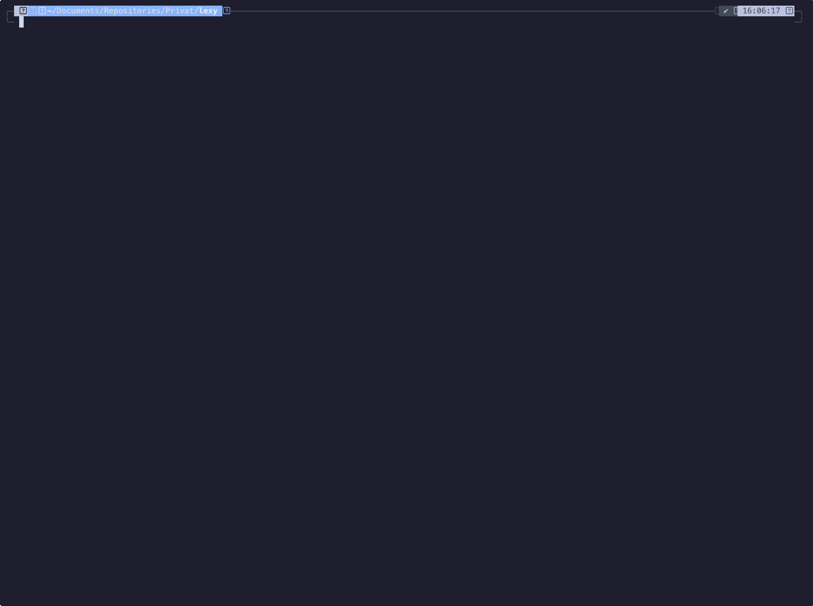

<div align="center" id="top">
  

&#xa0;

</div>

<p align="center">
  

  

  

  

  

  

  
</p>

 <h4 align="center">
 🚧  lexy 🚀 Under developing...  🚧
</h4>

<hr>

<p align="center">
  <a href="#dart-about">About</a> &#xa0; | &#xa0;
  <a href="#computer-demo">Demo</a> &#xa0; | &#xa0;
  <a href="#sparkles-features">Features</a> &#xa0; | &#xa0;
  <a href="#rocket-technologies">Technologies</a> &#xa0; | &#xa0;
  <a href="#white_check_mark-requirements">Requirements</a> &#xa0; | &#xa0;
  <a href="#checkered_flag-installation">Installation</a> &#xa0; | &#xa0;
  <a href="#bookmark_tabs-documentation">Documentation</a> &#xa0; | &#xa0;
  <a href="#lexy-license">License</a>
</p>

<br>

## :dart: About

**Lexy** is a lightweight CLI tool that fetches programming tutorials from [Learn X in Y Minutes](https://learnxinyminutes.com) directly into your terminal. Quickly search, learn, and reference code examples without leaving your workflow.

Lexy saves a local copy of the documentation, so you can access it even when you're offline. It also provides syntax highlighting using [bat](https://github.com/sharkdp/bat) and fuzzy search using [fzf](https://github.com/junegunn/fzf).

This project would not be possible without the amazing work of the [Learn X in Y Minutes](https://github.com/adambard/learnxinyminutes-docs) community. A huge thanks to all contributors for making high-quality learning resources freely available!

## :computer: Demo

<div align="center" id="top">
  

&#xa0;

</div>

## :sparkles: Features

:heavy_check_mark: Check documentation from "Learn X in Y minutes" directly from the terminal\
:heavy_check_mark: Syntax highlighting using [bat](https://github.com/sharkdp/bat)\
:heavy_check_mark: Local copy to speed up the process and avoid too many requests to the "Learn X in Y minutes" server\
:heavy_check_mark: Auto-update every 60 days\
:heavy_check_mark: Searching powered by [fzf](https://github.com/junegunn/fzf)

## :rocket: Technologies

The following tools were used in this project:

- [Click](https://click.palletsprojects.com/en/stable/)
- [Typer](https://typer.tiangolo.com)
- [Beautifulsoup](https://pypi.org/project/beautifulsoup4/)
- [fzf](https://github.com/junegunn/fzf)
- [bat](https://github.com/sharkdp/bat)

## :white_check_mark: Requirements

Before starting :checkered_flag:, you need to have [bat](https://github.com/sharkdp/bat) and [fzf](https://github.com/junegunn/fzf) installed.

### Important for Linux users

When installing [bat](https://github.com/sharkdp/bat) via `apt`, the executable may be installed as `batcat` instead of `bat`. In this case, you should follow these [steps](https://github.com/sharkdp/bat?tab=readme-ov-file#on-ubuntu-using-apt) to create the necessary symlink to make `lexy` work properly. **Note**: creating an alias will not work, as aliases are not visible to subprocesses started by Python.

## :checkered_flag: Installation

#### Manual Installation

```bash
git clone https://github.com/antoniorodr/lexy

cd lexy

pip install .
```

#### Homebrew Installation

```bash
brew tap antoniorodr/lexy
brew install antoniorodr/lexy/lexy
```

#### AUR Installation

```bash
yay -S lexy
```

#### Installation using [uv](https://docs.astral.sh/uv/)

```bash
uv tool install git+https://github.com/antoniorodr/lexy
```

## :bookmark_tabs: Documentation

First, make sure you have [bat](https://github.com/sharkdp/bat) and [fzf](https://github.com/junegunn/fzf) installed. Lexy requires it for syntax highlighting and searching.

You can use the command `lexy --help` to see all available options.

```bash
lexy --help
Usage: lexy [OPTIONS] <LANGUAGE>

  Display <LANGUAGE> documentation using bat.

  <LANGUAGE> refers to the language name or the following options:

  - Use "list" to view all available languages.

  - Use "update" to force update Lexy.

  - Use "modified" to view the last modified date of Lexy.

Options:
  --version  Show the version and exit.
  --help     Show this message and exit.
```

Lexy keeps a local copy of the documentation in `$HOME/.config/lexy`, which is created automatically the first time you run Lexy, and it will be updated every 60 days. You can force an update using "update" as `<LANGUAGE>`.

You can find the full documentation [here](https://antoniorodr.github.io/lexy/).

#### 🎨 Theming in Lexy (from v0.4.2)

Starting from **Lexy v0.4.2**, you can customize the appearance of the `fzf` interface used in the `lexy list` command.

By default, Lexy applies a color palette inspired by **Catppuccin Mocha**, but you can override it by creating a `config.toml` file in your Lexy config directory:

If you want to modify syntax highlighting for file previews powered by `bat`, refer to the [bat documentation](https://github.com/sharkdp/bat).

---

##### 🛠 Default Configuration

```toml
[fzf]
preview_percent = "60"
input_label = " Input "
border_label = " Enter: Open with bat │ Ctrl-D/U: scroll preview "

[colors]
border = "#aaaaaa"
label = "#cccccc"
preview_border = "#9999cc"
preview_label = "#ccccff"
list_border = "#669966"
list_label = "#99cc99"
input_border = "#996666"
input_label = "#ffcccc"
header_border = "#6699cc"
```

- `preview_percent` changes the size of the file preview window
- `input_label` changes the text of the input label
- `border_label` changes the text of the top of the window


Below is the configuration used in the second screenshot:

```toml
[colors]
border = "#ff0000"         # Red
label = "#00ff00"          # Green
preview_border = "#0000ff" # Blue
preview_label = "#ffff00"  # Yellow
list_border = "#ff00ff"    # Magenta
list_label = "#00ffff"     # Cyan
input_border = "#ffa500"   # Orange
input_label = "#800080"    # Lila
header_border = "#008000"  # Dark green
```

You can include only the parameters you'd like to override, Lexy will fall back to defaults for the rest.

## :memo: License

This project is under license from MIT. For more details, see the [LICENSE](LICENSE.md) file.

## :eyes: Do you like my work?

If you like my work and want to support me, you can buy me a coffee ☕ or even a burrito 🌯 by sponsoring me.

[](https://github.com/sponsors/antoniorodr)

&#xa0;

<a href="#top">Back to top</a>
