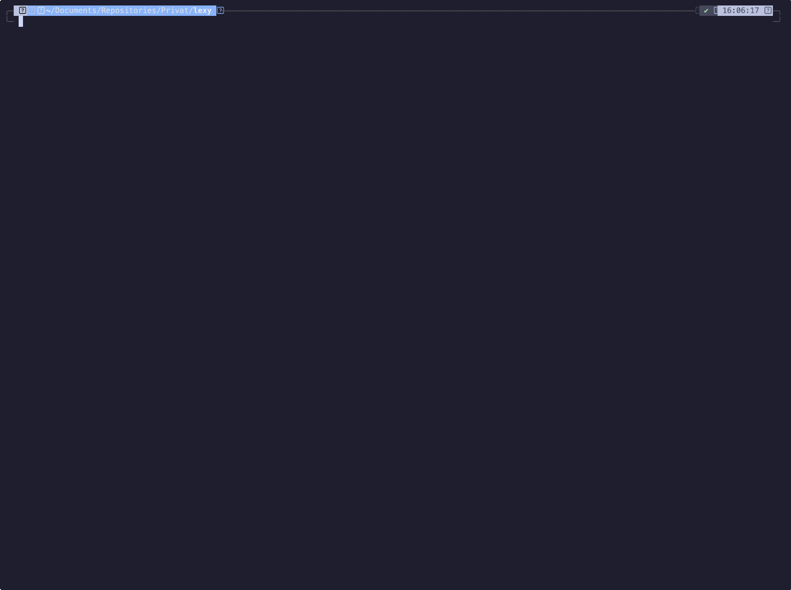

# `lexy`

> [!caution]
> **Status:** Under development

## ℹ️ About

**Lexy** is a lightweight Python CLI that brings tutorials from [Learn X in Y Minutes](https://learnxinyminutes.com) straight into your terminal. It is designed for quick lookup, learning, and reference without breaking your workflow.

Lexy keeps a local cache of the documentation so you can browse content offline, preview it with syntax highlighting through [bat](https://github.com/sharkdp/bat), and search available languages with [fzf](https://github.com/junegunn/fzf).

Full documentation is available at [antoniorodr.github.io/lexy](https://antoniorodr.github.io/lexy/).

>[!tip]
>If you uses Neovim, check out the [lexy.nvim plugin](https://github.com/antoniorodr/lexy.nvim)

## 🎬 Demo



## ✨ Features

- Read Learn X in Y Minutes tutorials directly from the terminal
- Browse cached documentation offline after the first fetch
- Preview syntax-highlighted content with `bat`
- Search available languages with `fzf`
- Refresh the local cache on demand with `lexy update`
- Check when the cache was last updated with `lexy modified`
- Customize the `fzf` layout and colors through `config.toml`

## 🛠️ Technologies

The project is built with:

- [Python](https://www.python.org/)
- [Typer](https://typer.tiangolo.com/)
- [Click](https://click.palletsprojects.com/en/stable/)
- [Beautiful Soup](https://pypi.org/project/beautifulsoup4/)
- [requests](https://pypi.org/project/requests/)
- [tomlkit](https://pypi.org/project/tomlkit/)
- [fzf](https://github.com/junegunn/fzf)
- [bat](https://github.com/sharkdp/bat)

## 📋 Requirements

Before starting, make sure the required tools and dependencies are installed on your machine:

```bash
python3.13 --version
fzf --version
bat --version
```

Lexy requires Python 3.13 or newer, plus `fzf` for searching and `bat` for syntax-highlighted previews.

On some Linux distributions, installing `bat` with `apt` provides the executable as `batcat` instead of `bat`. In that case, follow the [official bat instructions](https://github.com/sharkdp/bat?tab=readme-ov-file#on-ubuntu-using-apt) to create the required symlink, since a shell alias is not visible to the Python subprocess Lexy uses.

## 📦 Installation

### Manual installation

```bash
git clone https://github.com/antoniorodr/lexy
cd lexy
pip install .
```

### Homebrew installation

```bash
brew tap antoniorodr/lexy
brew install antoniorodr/lexy/lexy
```

### Installation with [uv](https://docs.astral.sh/uv/)

```bash
uv tool install git+https://github.com/antoniorodr/lexy
```

### AUR installation

```bash
yay -S lexy
```

## 🚀 Getting Started

Once installed, try the core commands:

```bash
lexy list
lexy python
lexy update
lexy modified
```

Use `lexy list` to browse available languages, pass a language name like `lexy python` to open a tutorial, use `lexy update` to refresh the local cache, and `lexy modified` to check when the cache was last updated.

Lexy stores its local documentation cache and configuration in `$HOME/.config/lexy`. The cache is created automatically on first run and refreshed automatically every 60 days.

If you want to customize the `fzf` interface, create a `config.toml` file in the Lexy config directory and override only the values you want to change.

For full usage details and theming examples, see the [documentation site](https://antoniorodr.github.io/lexy/).

## ❤️ Do you like my work?

If you find the project useful, you can support the author here:

[](https://github.com/sponsors/antoniorodr)
